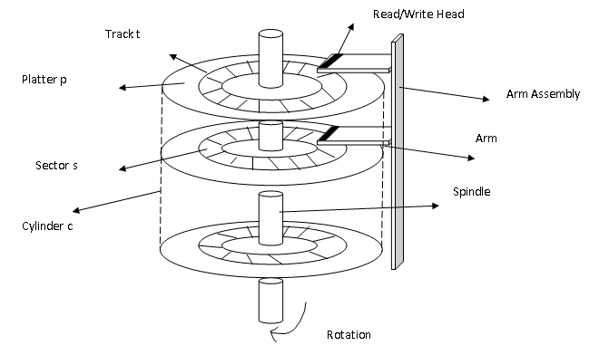

# Disk Scheduling Algorithms in Python

"> 
 

Implemented various Disk Scheduling Algorithms in Python
 
 <b> Following Disk Scheduling Algorithms are demonstrated: </b>
    1. FCFS 
    2. SSTF 
    3. SCAN 
    4. CSCAN 
    5. LOOK 
    6. CLOOK 
 
The process needs either CPU time or Input/Output Time. And for I/O it requires access to disk. The technique that operating system uses to determine the request which is to be satisfied next is called disk scheduling. 
 

 Image Source: 
https://notesformsc.org/computer-science/operating-systems/operating-systems-disk-scheduling-algorithms/  

 
 
Seek Time 
Seek time is the time taken in locating the disk arm to a specified track where the read/write request will be satisfied.
  
Rotational Latency 
It is the time taken by the desired sector to rotate itself to the position from where it can access the R/W heads.
  
Transfer Time 
It is the time taken to transfer the data.
  
Disk Access Time 
Disk access time is given as,
  
Disk Access Time = Rotational Latency + Seek Time + Transfer Time
  
Disk Response Time 
It is the average of time spent by each request waiting for the IO operation.

## Working Snapshot
 

 

 

 

 

 
